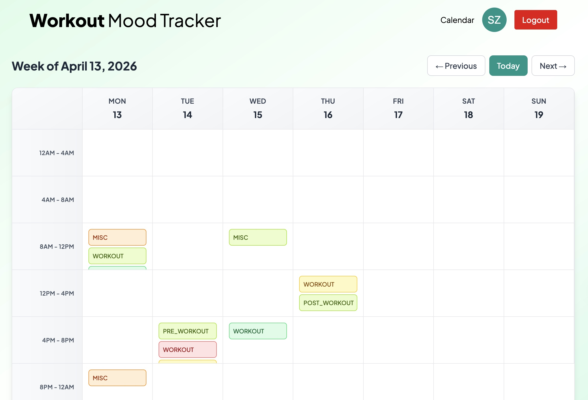
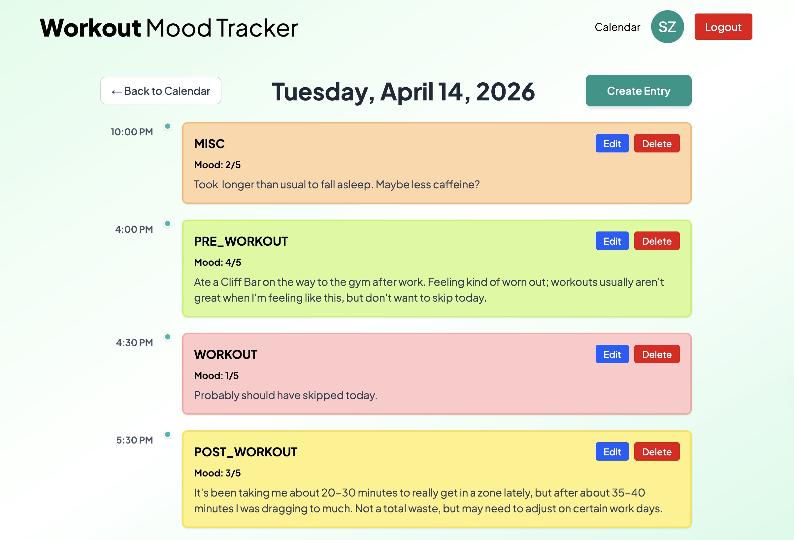

# Workout Mood Tracker


**One morning I was particularly frustrated during a workout in which I felt more flat than usual (probably an overload on energy drinks but let's not worry about that). I felt it might be a good idea to start taking notes about how I felt before, during, and after a workout -- so I built this app! Workout Mood Tracker allows users to track notes about their mood in the context of their workout schedule. Rather than tracking specific statistics regarding the workouts themselves, the focus is placed on logging how you feel.** 

🔗 [Live Demo](https://workout-mood-tracker-seven.vercel.app/) &nbsp;|&nbsp; [GitHub Repo](#)

---

## Screenshots


*[Caption: brief description of what's shown]*


*[Caption: brief description of what's shown]*

---

## Features

- **Mood Based Entry Logging** — Users can log entries with notes to describe their mood and any other relevant info before, after, or during a workout.
- **Weekly Calendar View** — The weekly calendar view has days divided into six 4-hour times blocks. Entries displayed are color-coded depending on the mood rating (1-5) given to that entry. Users can create entries from the weekly view. 
- **Daily View** — When a user wants more information regarding an actual entry they can click on the specific day from the weekly view and that will enter a daily view. Here entries will be displayed in chronological order and users will be able to perform edit and delete operations as well. Users can also create an entry from the daily view, and in this case the current date will be selected in the date input.
- **Secure user registration and login** — Each user's entries are private and only accessible to them.

---

## Tech Stack

| Frontend | Backend |
|----------|---------|
| React (Vite) | Node.js |
| Tailwind CSS | Express |
| | PostgreSQL |
| | Prisma ORM |
| | JWT Auth |

**Deployment:** Vercel / Railway

---

## Getting Started

### Prerequisites

- Node.js

### Installation

1. Clone the repo
   ```bash
   git clone https://github.com/Steeeeephen/workout-mood-tracker.git
   ```

2. Install dependencies for both frontend and backend
   ```bash
   cd client && npm install
   cd ../server && npm install
   ```

3. Set up environment variables

   Create a `.env` file in the server directory:
   ```
   DATABASE_URL=
   JWT_SECRET=
   PORT=
   ```

4. Run database migrations
   ```
   npx prisma migrate dev
   ```

5. Start the development servers
   ```
   # In the server directory
   npm run dev

   # In the client directory
   npm run dev
   ```

---

## Architecture & Design Decisions

- **Weekly Calendar View** — My first thought was a dashboard with a monthly calendar view so users could easily spot patterns in their entries. Ultimately I decided a weekly calendar would provide more meaningful information with a more entry details per day. The idea is to display enough information for users to be able to spot patterns in their entries.
- **Color Coded Mood Entries** — It made sense to color code entries based on the mood rating. This gives users information about their entries without having to leave the weekly calendar view, once again reinforcing the goal of spotting patterns at a glance.
- **JWT Authentication** — The first iteration of authentication had a bug in which a client could potentially access restricted routes even if the user account had been deleted. This was fixed by adding a check in the auth middleware. When a user accesses a protected route, the user id from the decoded token is checked against the user table, and if it does not exist a 401 is returned.

---

## Lessons Learned


While it was not an issue in development, I came across an issue regarding time zones when I made the app live on Vercel. Entries seemed to be rendering on the incorrect date and it was clear timezones were not being formatted correctly. Early in the project I may have been taking a hybrid approach to using 'date-fns' and vanilla JavaScript when formatting dates which led to this issue. After catching this, all date formatting was changed to 'date-fns' methods.

---

## Roadmap
- [ ] Mobile layout
- [ ] Entry Search Functionality
- [ ] User profile with personal stats
- [ ] Google OAuth
- [ ] Analytics
